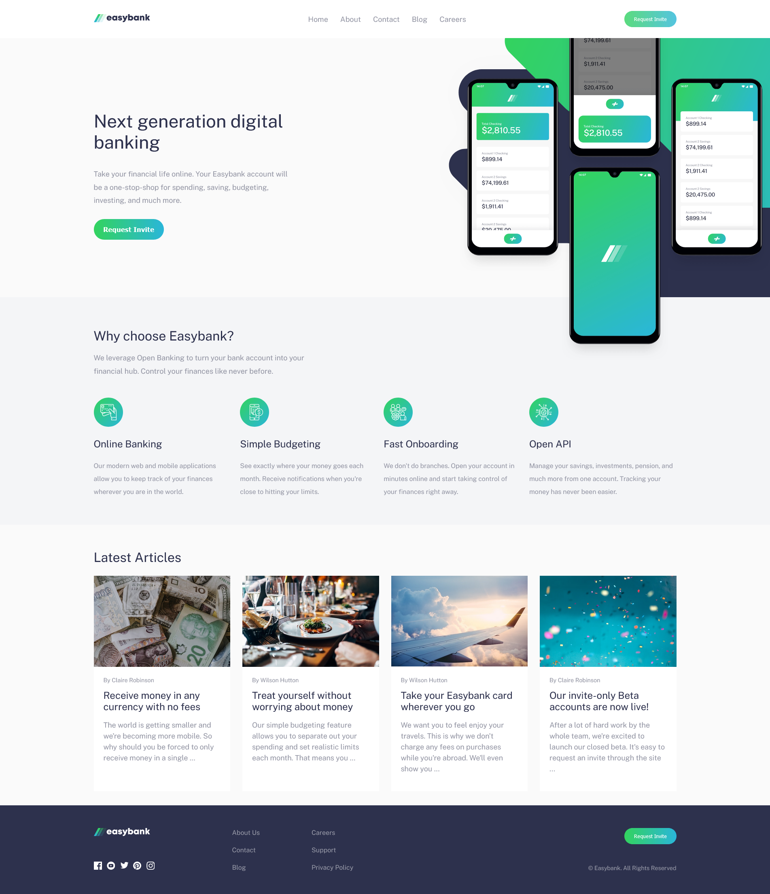

# Easybank landing page solution

<a href="https://fm-easybank-landingpage.vercel.app/" target="_blank">Easybank landing page solution Live Site</a>

## Overview

Users should be able to:

-   View the optimal layout for the site depending on their device's screen size
-   See hover states for all interactive elements on the page

### Built with

-   HTML/CSS
-   CSS Flexbox
-   Vanilla JS

### Screenshot

This is a [solution](https://www.frontendmentor.io/solutions/flexbox-landing-page-mepSrX6Ij9) to the [Easybank landing page challenge on Frontend Mentor](https://www.frontendmentor.io/challenges/easybank-landing-page-WaUhkoDN).
